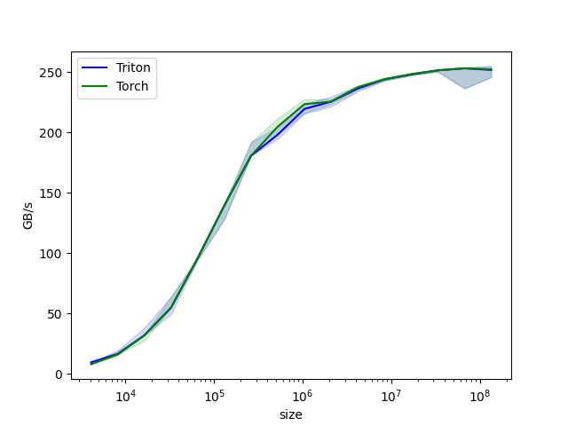

# Tutorials

Below are the tutorials for writing various basic operations with Trition.

## Vector Additon

In this tutorial, you will write a simple vector addition using Triton.

In doing so, you will learn about:

- The basic programming model of Triton.
- The *triton.jit* decorator, which is used to define Triton kernels.
- The best parctices for validating and benchmarking your custom ops against native reference implementations.

### Compute Kernel

```python 
import torch  
import triton  
import triton.language as tl  
  
DEVICE = triton.runtime.driver.active.get_active_torch_device()  
  
  
@triton.jit  
def add_kernel(x_ptr, y_ptr, output_ptr, n_elements, BLOCK_SIZE: tl.constexpr):  
    '''  
    add kernel    :param x_ptr: pointer to first input vector    :param y_ptr: pointer to second input vector    :param output_ptr: pointer to output vector    :param n_elements: size of the vector    :param BLOCK_SIZE: number of elements each program should process    :return:  
    '''  
    pid = tl.program_id(axis=0)  # We use a 1D launch grid so axis is 0  
  
    # This progrom will process inputs that are offset from the initial data.    # For instance, if you have a vector of length 256 and block_size of 64, the programs    # would each access the elements [0:64,64:128, 128:192, 192:256].    # Note that offsets is a list of pointers.    
    
    block_start = pid * BLOCK_SIZE  
    offsets = block_start + tl.arange(0, BLOCK_SIZE)  
  
    # Create a mask to guard memory oprations against out-of-bounds accesses.  
    mask = offsets < n_elements  
  
    # Load x and y from DRAM, masking out any extra elements in case the input is not a multiple of the block size.  
    x = tl.load(x_ptr + offsets, mask=mask)  
    y = tl.load(y_ptr + offsets, mask=mask)  
    output = x + y  
    tl.store(output_ptr + offsets, output, mask=mask)
```

Let's also declare a helper function to **allocate the z tensor** and **enqueue the above kernel with appropriate grid/block sizes**:

```python
def add(x: torch.Tensor, y: torch.Tensor):  
    # We need to preallocate the output.  
    output = torch.empty_like(x)  
    if not (x.device == DEVICE and y.device == DEVICE and output.device == DEVICE):  
        raise "x, y, output is not at same device"  
    n_elements = output.numel()  
    # The SPMD (Single Program Multiple Data) launch grid denotes the number of kernel instances that run in parallel.  
    # It is analogous to CUDA launch grids. It can be either Tuple[int], or Callable(metaparameters) -> Tuple[int].    
    # In this case, we use a 1D grid where the size is the number of blocks:    
    grid = lambda meta: (triton.cdiv(n_elements, meta['BLOCK_SIZE']),)  
    # NOTE:  
    # - Each torch.tensor object is implicitly converted into a pointer to its first element.    # - `triton.jit`'ed functions can be indexed with a launch grid to obtain a callable GPU kernel.    # - Don't forget to pass meta-parameters as keywords arguments.    
    add_kernel[grid](x, y, output, n_elements, BLOCK_SIZE=1024)  
    # We return a handle to z, but since `torch.cuda.synchronize()` hasn't been called, the kernel is still running asynchronously at this point.  
    return output
```

We can now use the above function to compute the element-wise sum of two *torch.tensor* objects and test its correctness:

```python
torch.manual_seed(0)
size = 98432
x = torch.rand(size, device=DEVICE)
y = torch.rand(size, device=DEVICE)
output_torch = x + y
output_triton = add(x, y)
print(output_torch)
print(output_triton)
print(f'The maximum difference between torch and triton is '
      f'{torch.max(torch.abs(output_torch - output_triton))}')
```

Out:
```python
tensor([1.3713, 1.3076, 0.4940,  ..., 0.6724, 1.2141, 0.9733], device='cuda:0')
tensor([1.3713, 1.3076, 0.4940,  ..., 0.6724, 1.2141, 0.9733], device='cuda:0')
The maximum difference between torch and triton is 0.0
```

### Benchmarks

We can now benchmark our custom op on vectors of increasing sizes to get a sense of how it does relative to PyTorch. To make things easier, Triton has a set of built-in utilities that allow us to concisely plot performance of our custom ops for different problem sizes.

```python
@triton.testing.perf_report(  
    triton.testing.Benchmark(  
        x_names=['size'],  
        x_vals=[2 ** i for i in range(12, 28, 1)],  
        x_log=True,  
        line_arg='provider',  
        line_vals=['triton', 'torch'],  
        line_names=['Triton', 'Torch'],  
        styles=[('blue', '-'), ('green', '-')],  
        ylabel='GB/s',  
        plot_name='vector-add-performance',  
        args={},  
    ))  
def benchmark(size, provider):  
    x = torch.rand(size, device=DEVICE, dtype=torch.float32)  
    y = torch.rand(size, device=DEVICE, dtype=torch.float32)  
    quantiles = [0.5, 0.2, 0.8]  
    if provider == 'torch':  
        ms, min_ms, max_ms = triton.testing.do_bench(lambda: x + y, quantiles=quantiles)  
    if provider == 'triton':  
        ms, min_ms, max_ms = triton.testing.do_bench(lambda: add(x, y), quantiles=quantiles)  
    gbps = lambda ms: 3 * x.numel() * x.element_size() * 1e-9 / (ms * 1e-3)  
    return gbps(ms), gbps(min_ms), gbps(max_ms)  
```

We can now run the decorated function above. Pass *print_data=True* to see the performance number, *show_plots=True* to plot them, and *save_path='path_to_results'* to save them to disk along with raw CSV data:

```python
benchmark.run(print_data=True, show_plots=True)
```



## Fused Softmax

In this tutorial, you will write a fused softmax operation that is significantly than PyTorch's native op for a particular class of matrices: those whose rows can fit in the GPU's SRAM.

In doing so, you will learn about:

- The benefits of kernel fusion (内核融合) for bandwidth-bound (带宽受限) operations.
- Reduction operators in Triton.

### Motivations

Custom GPU kernels for elementwise additons are educationally valuable but won't get you very far in practice. Let us consider instead the case of a simple (numerically stabilized) softmax operation:

```python
import torch  
import triton  
import triton.language as tl  
from triton.runtime import driver  
  
DEVICE = triton.runtime.driver.active.get_active_torch_device()  
  
  
def is_hip():  
    return triton.runtime.driver.active.get_current_target().backend == 'hip'  
  
  
def is_cdna():  
    return is_hip() and triton.runtime.driver.active.get_current_target().arch in ('gfx940', 'gfx941', 'gfx942',  
                                                                                   'gfx90a', 'gfx908')  
  
  
def naive_softmax(x):  
    '''Compute row-wise softmax of X using native pytorch  
  
    We subtract the maximum element in order to avoid overflows. Softmax is invariant(不变的) to this shift.  
    '''  
    # read MN elements; write M elements  
    x_max = x.max(dim=1).values  
    # read MN + M elements; write MN elements  
    z = x - x_max[:, None]  
    # read MN elements; write MN elements  
    numerator = torch.exp(z)  
    # read MN elements; write M elements  
    denominator = numerator.sum(dim=1)  
    # read MN + M elements; write MN elements  
    ret = numerator / denominator[:, None]  
    # in total: read 5MN + 2M elements; wrote 3MN + 2M elements  
    return ret
```

Computing `y = naive_softmax(x)` for $x \in R^{M \times N}$ requires reading $5MN + 2M$ elements from DRAM and write back $3MN + 2M$ elements. This is obviously wasteful; we'd prefer to have a custom "fused" kenel that only reads X once and does all the necessary computations on-chip. Doing so would require reading and writing back only $MN$ bytes, so we could expect a theoretical speed-up of ~4x. The `torch.jit.script` flags aims to perform this kind of "kernel fusion" automatically but, as we will see later, ti is still far from ideal.

### Compute Kernel

Our softmax kernel works as follows: each program loads a set of rows of the input matrix X strided by number of programs, normalizes it and writes back the result to the output Y.

Note that one important limitation of Triton is that each block must have a power-of-two number of elements, so we need to internally "pad" each row and guard the memory operations properly if we want to handle any possible input shapes:

```python
@triton.jit  
def softmax_kernel(output_ptr, input_ptr, input_row_stride, output_row_stride, n_rows, n_cols, BLOCK_SIZE: tl.constexpr,  
                   num_stages: tl.constexpr):  
    # starting row of the program  
    row_start = tl.program_id(0)  
    row_step = tl.num_programs(0)  
    for row_idx in tl.range(row_start, n_rows, row_step, num_stages=num_stages):  
        # The stride represents how much we need to increase the pointer to advance 1 row  
        row_start_ptr = input_ptr + row_idx * input_row_stride  
        # The block size is the next power of two greater than n_cols, so we can fit each row in a single block  
        col_offsets = tl.arange(0, BLOCK_SIZE)  
        input_ptrs = row_start_ptr + col_offsets  
        # Load the row into SRAM, using a mask since BLOCK_SIZE may be bigger than n_cols  
        mask = col_offsets < n_cols  
        row = tl.load(input_ptrs, mask=mask, other=-float('inf'))  
        # Subtract maximum for numerical stability  
        row_minus_max = row - tl.max(row, axis=0)  
        # Note that exponentiation in Triton is fast but approximate(近似的)  
        numerator = tl.exp(row_minus_max)  
        denominator = tl.sum(numerator, axis=0)  
        softmax_output = numerator / denominator  
        # Write back output to DRAM  
        output_row_start_ptr = output_ptr + row_idx * output_row_stride  
        output_ptrs = output_row_start_ptr + col_offsets  
        tl.store(output_ptrs, softmax_output, mask=mask)
```